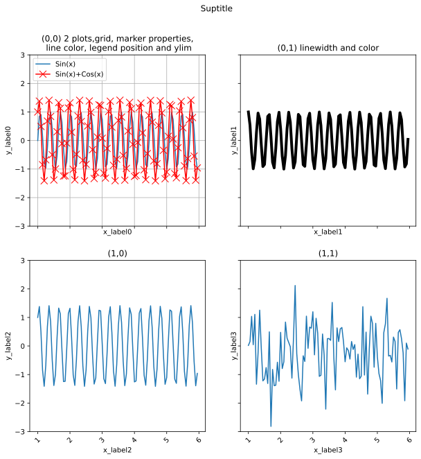
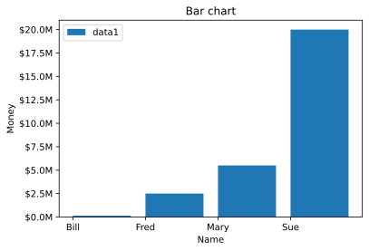
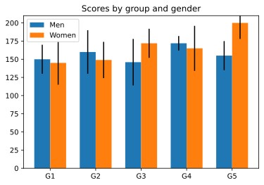
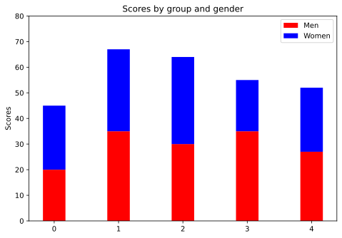
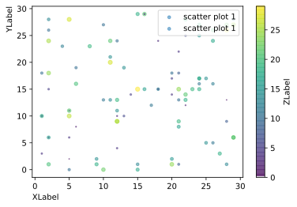
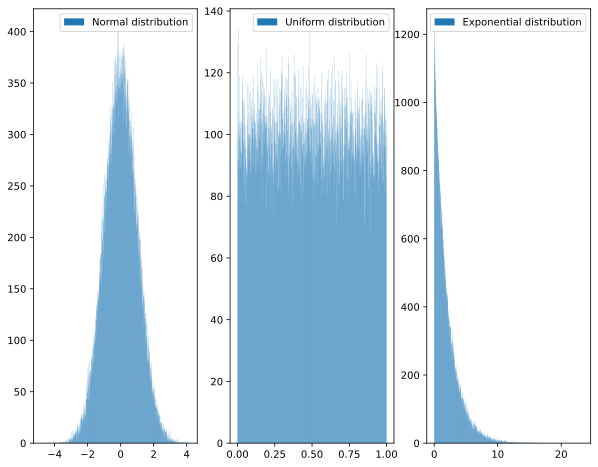
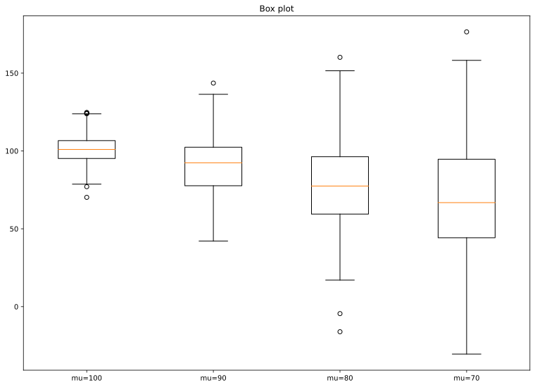

<br/>
<br/>
<br/>
<br/>
<br/>
<br/>
<br/>
<br/>
<br/>
<br/>
<br/>
<br/>
<br/>
<br/>

<center> 

# 本文紀錄Python繪圖的方法-使用 Matplotlib

<center/>

<div style="page-break-after: always;"></div>


引入Matplotlib模組


```python
import numpy as np
import matplotlib.pyplot as plt
```

## Matplotlib 繪圖
> Matplotlib有很多種畫法，不同指令也可以達到相同效果
但較好也較全面的姿勢應該是先釐清fig,ax的關係

> step1:設定好fig,ax和subplots數目及figsize

> step2:個別指定每個ax的畫圖種類，例如line plot, bar chart or hist chart...

> step3:個別指定每個ax的屬性，例如label, xlabel, ylabel,xlim,ylim, legend, xticklabels等等


```python
x=np.arange(100)
y0=np.sin(x)
y1=np.cos(x)
y2=np.sin(x)+np.cos(x)
y3=np.random.randn(100)
fig,axs=plt.subplots(2,2,figsize=(10,10),sharex=True,sharey=True)

axs[0][0].plot(x,y0,label='Sin(x)')
axs[0][1].plot(x,y1,label='Con(x)',linewidth=4,color='black')
axs[1][0].plot(x,y2,label='Sin(x)+Cos(x)')
axs[1][1].plot(x,y3,label='Random')

axs[0][0].set_title('(0,0) 2 plots,grid, marker properties,\n line color, legend position and ylim')
axs[0][1].set_title('(0,1) linewidth and color')
axs[1][0].set_title('(1,0)')
axs[1][1].set_title('(1,1)')

axs[0][0].set_xlabel('x_label0')
axs[0][1].set_xlabel('x_label1')
axs[1][0].set_xlabel('x_label2')
axs[1][1].set_xlabel('x_label3')

axs[0][0].set_ylabel('y_label0')
axs[0][1].set_ylabel('y_label1')
axs[1][0].set_ylabel('y_label2')
axs[1][1].set_ylabel('y_label3')

axs[1][0].set_xticklabels(labels=x,rotation=45)
axs[1][1].set_xticklabels(labels=x,rotation=45)
axs[0][0].grid(True)


# axs[0][0].legend(['legend'],loc=2)
axs[0][0].plot(x,y2,label='Sin(x)+Cos(x)',marker='x',markersize=10,color='r')
axs[0][0].legend(loc=2)
axs[0][0].set_ylim(-3,3)

fig.suptitle('Suptitle')
```


    Text(0.5, 0.98, 'Suptitle')


    

    


# Bar chart
> Axes.bar(self, x, height, width=0.8, bottom=None, *, align='center', data=None, **kwargs)[source]


```python
money = [1.5e5, 2.5e6, 5.5e6, 2.0e7]


def millions(x, pos):
    """The two args are the value and tick position."""
    return '${:1.1f}M'.format(x*1e-6)

fig, ax = plt.subplots()
# Use automatic FuncFormatter creation
ax.yaxis.set_major_formatter(millions)
ax.bar(['Bill', 'Fred', 'Mary', 'Sue'], money,label='data1',align='edge')
ax.set_title('Bar chart')
ax.set_xlabel('Name')
ax.set_ylabel('Money')
ax.legend(loc=2)
```


    <matplotlib.legend.Legend at 0x7fb3d6b3b130>


    

    


```python
import numpy as np
# from basic_units import cm, inch
import matplotlib.pyplot as plt

cm=1
inch=cm*0.039


fig, ax = plt.subplots()
N = 5
ind = np.arange(N)    # the x locations for the groups
width = 0.35         # the width of the bars


men_means = [150*cm, 160*cm, 146*cm, 172*cm, 155*cm]
men_std = [20*cm, 30*cm, 32*cm, 10*cm, 20*cm]
ax.bar(x=ind, height=men_means, width=width, bottom=0*cm, yerr=men_std, label='Men')


women_means = (145*cm, 149*cm, 172*cm, 165*cm, 200*cm)
women_std = (30*cm, 25*cm, 20*cm, 31*cm, 22*cm)
ax.bar(x=ind + width, height=women_means, width=width, bottom=0*cm, yerr=women_std,label='Women')

ax.set_title('Scores by group and gender')
ax.set_xticks(ind + width / 2)
ax.set_xticklabels(('G1', 'G2', 'G3', 'G4', 'G5'))

ax.legend()
ax.yaxis.set_units(inch)
ax.autoscale_view()
```


    

    


```python
import numpy as np
import matplotlib.pyplot as plt
N = 5
menMeans = (20, 35, 30, 35, 27)
womenMeans = (25, 32, 34, 20, 25)
ind = np.arange(N) # the x locations for the groups
width = 0.35
fig = plt.figure()
ax = fig.add_axes([0,0,1,1])
ax.bar(ind, menMeans, width, color='r')
ax.bar(ind, womenMeans, width,bottom=menMeans, color='b')
ax.set_ylabel('Scores')
ax.set_title('Scores by group and gender')
ax.set_xticks(ind, ('G1', 'G2', 'G3', 'G4', 'G5'))
ax.set_yticks(np.arange(0, 81, 10))
ax.legend(labels=['Men', 'Women'])
plt.show()

```


    

    


# Scatter plot([參考連結](https://matplotlib.org/stable/api/_as_gen/matplotlib.axes.Axes.scatter.html))
> Axes.scatter(self, x, y, s=None, c=None, marker=None, cmap=None, norm=None, vmin=None, vmax=None, alpha=None, linewidths=None, verts=<deprecated parameter>, edgecolors=None, *, plotnonfinite=False, data=None, **kwargs


```python
import matplotlib.pyplot as plt

fig, ax = plt.subplots()
N=50
x=np.random.randint(30,size=N)
y=np.random.randint(30,size=N)
c=np.random.randint(30,size=N)
size=np.exp(np.random.randint(10,size=N)*200)
sc = ax.scatter(x=x, y=y, c=c,s=c,alpha=0.5,label='scatter plot 1')


N=50
x=np.random.randint(30,size=N)
y=np.random.randint(30,size=N)
c=np.random.randint(30,size=N)
size=np.exp(np.random.randint(10,size=N)*200)
sc = ax.scatter(x=x, y=y, c=c,s=c,alpha=0.5,label='scatter plot 1')

ax.set_ylabel('YLabel', loc='top')
ax.set_xlabel('XLabel', loc='left')
ax.legend(loc=1)

cbar = fig.colorbar(sc)
cbar.set_label("ZLabel", loc='center')

```


    

    


# Hist. plot([參考連結](https://matplotlib.org/3.3.4/api/_as_gen/matplotlib.pyplot.hist.html))

> matplotlib.pyplot.hist(x, bins=None, range=None, density=False, weights=None, cumulative=False, bottom=None, histtype='bar', align='mid', orientation='vertical', rwidth=None, log=False, color=None, label=None, stacked=False, *, data=None, **kwargs)[source]


```python
import numpy as np
import matplotlib.pyplot as plt
fig,ax=plt.subplots(1,3,figsize=(10,8))

normal_samples = np.random.normal(size = 100000) # 生成 100000 組標準常態分配（平均值為 0，標準差為 1 的常態分配）隨機變數
uniform_samples = np.random.uniform(size = 100000) # 生成 100000 組介於 0 與 1 之間均勻分配隨機變數
exp_samples=np.random.exponential(scale=2,size=100000) 

ax[0].hist(x=normal_samples,bins=1000,label='Normal distribution')
ax[1].hist(x=uniform_samples,bins=1000,label='Uniform distribution')
ax[2].hist(x=exp_samples,bins=1000,label='Exponential distribution')

ax[0].legend()
ax[1].legend()
ax[2].legend()
```


    <matplotlib.legend.Legend at 0x7fb3d8934550>


    

    


# Box plot


```python
# Import libraries 
import matplotlib.pyplot as plt 
import numpy as np 
  
  
# Creating dataset 
np.random.seed(10) 
  
data_1 = np.random.normal(100, 10, 200) 
data_2 = np.random.normal(90, 20, 200) 
data_3 = np.random.normal(80, 30, 200) 
data_4 = np.random.normal(70, 40, 200) 
data = [data_1, data_2, data_3, data_4] 

fig = plt.figure(figsize =(10, 7)) 
  
# Creating axes instance 
#
ax = fig.add_axes([0, 0, 1, 1]) 
  
# Creating plot 
bp = ax.boxplot(data,labels=['mu=100','mu=90','mu=80','mu=70']) 
ax.set_title('Box plot')

# show plot 
plt.show() 
```


    

    


# Kde plot
用seaborn比較好畫
