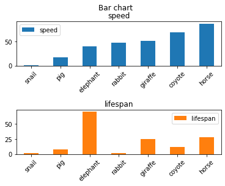
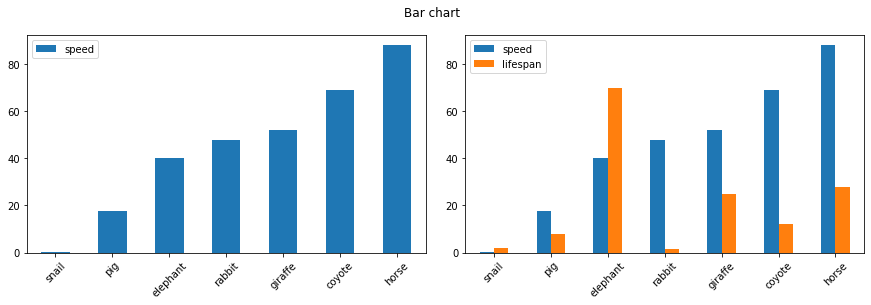
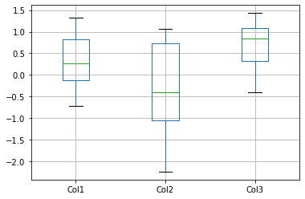

<br/>
<br/>
<br/>
<br/>
<br/>
<br/>
<br/>
<br/>
<br/>
<br/>
<br/>
<br/>
<br/>
<br/>

<center> 

# 本文紀錄Python繪圖的方法-使用 pandas

<center/>


<div style="page-break-after: always;"></div>


```python
import numpy as np
import matplotlib.pyplot as plt
import pandas as pd
import seaborn as sns
```

## pandas 繪圖([參數連結](https://pandas.pydata.org/pandas-docs/version/0.23.4/generated/pandas.DataFrame.plot.html))

 


```python
data=np.random.randn(1000,4)
df=pd.DataFrame(data=data,index=np.arange(1000),columns=['a','b','c','d'])
```

### line plot


```python
fig, axs = plt.subplots(2, 1,sharex=True)
df.plot(y=['a'],kind='line',ax=axs[0],title='ax1')
df.plot(y=['b','c','d'],kind='line',ax=axs[1],title='ax2',figsize=(10,8))
axs[0].set_ylabel('ylabel')
axs[1].set_ylabel('ylabel')
axs[1].set_xlabel('Xlabel')
fig.suptitle('This is a somewhat long figure title', fontsize=16)
```


    Text(0.5, 0.98, 'This is a somewhat long figure title')


    

    


```python
fig, axs = plt.subplots(1, 2,sharey=True)
df.plot(y=['a'],kind='line',ax=axs[0],legend=False)
df.plot(y=['b','c','d'],kind='line',ax=axs[1],figsize=(20,5))
#設定title
axs[0].set_title('ax1')
axs[1].set_title('ax2')
#設定label
axs[0].set_xlabel('xlabel')
axs[1].set_xlabel('xlabel')
axs[0].set_xlabel('ylabel')
#調整各個圖的間距
plt.subplots_adjust(hspace=0.5,  wspace=0.1)
```


    

    


### bar chart([參數連結](https://pandas.pydata.org/pandas-docs/version/0.23/generated/pandas.DataFrame.plot.bar.html))

 


```python
speed = [0.1, 17.5, 40, 48, 52, 69, 88]
lifespan = [2, 8, 70, 1.5, 25, 12, 28]
index = ['snail', 'pig', 'elephant','rabbit', 'giraffe', 'coyote', 'horse']
df = pd.DataFrame({'speed': speed,'lifespan': lifespan}, index=index)
ax = df.plot.bar(rot=45)#rot表示xstick旋轉的角度
ax.legend(loc=2)#legend的位置可以用loc調整
```


    <matplotlib.legend.Legend at 0x1bab28437c0>


    

    


```python
axes = df.plot.bar(rot=45, subplots=True,sharex=False)
axes[1].legend(loc=1)
plt.subplots_adjust(hspace=1,  wspace=0.5)#調整各個ax間的距離
plt.suptitle('Bar chart')
```


    Text(0.5, 0.98, 'Bar chart')


    

    


```python
fig,axs=plt.subplots(1,2,sharey=False,figsize=(15,4))
df.plot.bar(y='speed', rot=45,ax=axs[0])
df.plot.bar(y=['speed','lifespan'], rot=45,ax=axs[1])
plt.subplots_adjust(wspace=0.1)
plt.suptitle('Bar chart')
```


    Text(0.5, 0.98, 'Bar chart')


    

    


### scatter plot chart([參數連結](https://pandas.pydata.org/pandas-docs/version/0.25.0/reference/api/pandas.DataFrame.plot.scatter.html))

 


```python
fig,axs=plt.subplots(1,2,figsize=(20,8),sharey=False)
df = pd.DataFrame([[5.1, 3.5, 0], [4.9, 3.0, 0], [7.0, 3.2, 1],[6.4, 3.2, 1], [5.9, 3.0, 2]],
                  columns=['length', 'width', 'species'])
df.plot.scatter(x='length',y='width',s=50,marker='*',c='species',colormap='viridis',ax=axs[0])#s設定點的大小


df.plot.bar(y=['length'], rot=45,ax=axs[1])
axs[1].set_xlabel('xlabel')
axs[1].set_ylabel('ylabel')
axs[1].legend(loc=2)
plt.suptitle('scatter plot')
plt.subplots_adjust(wspace=0.1)
```


    

    


### hist plot([參考連結](https://pandas.pydata.org/pandas-docs/version/0.23.4/generated/pandas.DataFrame.plot.hist.html))

 


```python
fig,ax=plt.subplots(1,1,figsize=(10,8))
df = pd.DataFrame(np.random.randint(1, 7, 6000),columns = ['one'])
df['two'] = df['one'] + np.random.randint(1, 7, 6000)
df.plot.hist(bins=12, alpha=0.5,ax=ax)
ax.set_title('Hist. plot')
ax.set_xlabel('Xlabel')
```


    Text(0.5, 0, 'Xlabel')


    

    


### box plot([參考連結](https://pandas.pydata.org/pandas-docs/version/0.25.0/reference/api/pandas.DataFrame.boxplot.html))

 


```python
np.random.seed(1234)
df = pd.DataFrame(np.random.randn(10,4),columns=['Col1', 'Col2', 'Col3', 'Col4'])
df.boxplot(column=['Col1', 'Col2', 'Col3'])
```


    <AxesSubplot:>


    

    


### kde plot([參考連結](https://pandas.pydata.org/pandas-docs/stable/reference/api/pandas.DataFrame.plot.kde.html))

 


```python
speed = [0.1, 17.5, 40, 48, 52, 69, 88]
lifespan = [2, 8, 70, 1.5, 25, 12, 28]
index = ['snail', 'pig', 'elephant','rabbit', 'giraffe', 'coyote', 'horse']
df = pd.DataFrame({'speed': speed,'lifespan': lifespan}, index=index)
ax = df.plot.hist(y='lifespan',rot=45)#rot表示xstick旋轉的角度

```


    

    


```python
df = pd.DataFrame({'x': [1, 2, 2.5, 3, 3.5, 4, 5],'y': [4, 4, 4.5, 5, 5.5, 6, 6],})
df.plot.kde()
```


    <AxesSubplot:ylabel='Density'>


    

    


```python

```
