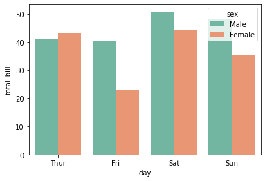
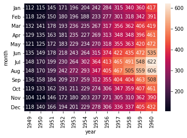
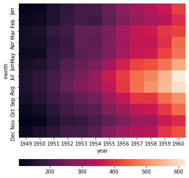

<br/>
<br/>
<br/>
<br/>
<br/>
<br/>
<br/>
<br/>
<br/>
<br/>
<br/>
<br/>
<br/>
<br/>
<center> 

# 本文紀錄Python繪圖的方法-使用 Seaborn

<center/>


<div STYLE="page-break-after: always;"></div>


```python
#匯入必要模組
import numpy as np
import matplotlib.pyplot as plt
import pandas as pd
import seaborn as sns
```

# [lineplot](https://seaborn.pydata.org/generated/seaborn.lineplot.html)

> seaborn.lineplot(*, x=None, y=None, hue=None, size=None, style=None, data=None, palette=None, hue_order=None, hue_norm=None, sizes=None, size_order=None, size_norm=None, dashes=True, markers=None, style_order=None, units=None, estimator='mean', ci=95, n_boot=1000, seed=None, sort=True, err_style='band', err_kws=None, legend='auto', ax=None, **kwargs)

說明可見[連結](https://blog.csdn.net/zyb228/article/details/100899779)


```python
#匯入data
fmri = sns.load_dataset("fmri")
```


```python
#觀察fmri的資料型態是pandas
print(type(fmri))
#觀察欄位
print(fmri.head())
```

    <class 'pandas.core.frame.DataFrame'>
      subject  timepoint event    region    signal
    0     s13         18  stim  parietal -0.017552
    1      s5         14  stim  parietal -0.080883
    2     s12         18  stim  parietal -0.081033
    3     s11         18  stim  parietal -0.046134
    4     s10         18  stim  parietal -0.037970


```python
ax = sns.lineplot(x="timepoint", y="signal", data=fmri,err_style=None)
```


    

    


```python
ax = sns.lineplot(x="timepoint", y="signal", data=fmri,err_style='band')
```


    

    


```python
ax = sns.lineplot(x="timepoint", y="signal", data=fmri,err_style='bars')
```


    

    


```python
fig,axs=plt.subplots(1,2,figsize=(10,8),sharey=True)
sns.lineplot(x="timepoint", y="signal", hue="event",data=fmri,ax=axs[0])
sns.lineplot(x="timepoint", y="signal", data=fmri,err_style='bars',ax=axs[1])
#設定hue="event"會畫出，不同的event對應的signal數值vs.timepoint
```


    <AxesSubplot:xlabel='timepoint', ylabel='signal'>


    

    


```python
flights = sns.load_dataset("flights")
flights.head()
```


<div>
<style scoped>
    .dataframe tbody tr th:only-of-type {
        vertical-align: middle;
    }

    .dataframe tbody tr th {
        vertical-align: top;
    }

    .dataframe thead th {
        text-align: right;
    }
</style>
<table border="1" class="dataframe">
  <thead>
    <tr style="text-align: right;">
      <th></th>
      <th>year</th>
      <th>month</th>
      <th>passengers</th>
    </tr>
  </thead>
  <tbody>
    <tr>
      <th>0</th>
      <td>1949</td>
      <td>Jan</td>
      <td>112</td>
    </tr>
    <tr>
      <th>1</th>
      <td>1949</td>
      <td>Feb</td>
      <td>118</td>
    </tr>
    <tr>
      <th>2</th>
      <td>1949</td>
      <td>Mar</td>
      <td>132</td>
    </tr>
    <tr>
      <th>3</th>
      <td>1949</td>
      <td>Apr</td>
      <td>129</td>
    </tr>
    <tr>
      <th>4</th>
      <td>1949</td>
      <td>May</td>
      <td>121</td>
    </tr>
  </tbody>
</table>
</div>


```python
flights_wide = flights.pivot("year", "month", "passengers")
flights_wide.head()
```


<div>
<style scoped>
    .dataframe tbody tr th:only-of-type {
        vertical-align: middle;
    }

    .dataframe tbody tr th {
        vertical-align: top;
    }

    .dataframe thead th {
        text-align: right;
    }
</style>
<table border="1" class="dataframe">
  <thead>
    <tr style="text-align: right;">
      <th>month</th>
      <th>Jan</th>
      <th>Feb</th>
      <th>Mar</th>
      <th>Apr</th>
      <th>May</th>
      <th>Jun</th>
      <th>Jul</th>
      <th>Aug</th>
      <th>Sep</th>
      <th>Oct</th>
      <th>Nov</th>
      <th>Dec</th>
    </tr>
    <tr>
      <th>year</th>
      <th></th>
      <th></th>
      <th></th>
      <th></th>
      <th></th>
      <th></th>
      <th></th>
      <th></th>
      <th></th>
      <th></th>
      <th></th>
      <th></th>
    </tr>
  </thead>
  <tbody>
    <tr>
      <th>1949</th>
      <td>112</td>
      <td>118</td>
      <td>132</td>
      <td>129</td>
      <td>121</td>
      <td>135</td>
      <td>148</td>
      <td>148</td>
      <td>136</td>
      <td>119</td>
      <td>104</td>
      <td>118</td>
    </tr>
    <tr>
      <th>1950</th>
      <td>115</td>
      <td>126</td>
      <td>141</td>
      <td>135</td>
      <td>125</td>
      <td>149</td>
      <td>170</td>
      <td>170</td>
      <td>158</td>
      <td>133</td>
      <td>114</td>
      <td>140</td>
    </tr>
    <tr>
      <th>1951</th>
      <td>145</td>
      <td>150</td>
      <td>178</td>
      <td>163</td>
      <td>172</td>
      <td>178</td>
      <td>199</td>
      <td>199</td>
      <td>184</td>
      <td>162</td>
      <td>146</td>
      <td>166</td>
    </tr>
    <tr>
      <th>1952</th>
      <td>171</td>
      <td>180</td>
      <td>193</td>
      <td>181</td>
      <td>183</td>
      <td>218</td>
      <td>230</td>
      <td>242</td>
      <td>209</td>
      <td>191</td>
      <td>172</td>
      <td>194</td>
    </tr>
    <tr>
      <th>1953</th>
      <td>196</td>
      <td>196</td>
      <td>236</td>
      <td>235</td>
      <td>229</td>
      <td>243</td>
      <td>264</td>
      <td>272</td>
      <td>237</td>
      <td>211</td>
      <td>180</td>
      <td>201</td>
    </tr>
  </tbody>
</table>
</div>


```python
#畫出不同月份乘客人數和年份的關係
sns.lineplot(data=flights_wide)
```


    <AxesSubplot:xlabel='year'>


    

    


```python
#和上例是等效的，但是每組以不同“顏色”線分開
sns.lineplot(data=flights, x="year", y="passengers", hue="month")
```


    <AxesSubplot:xlabel='year', ylabel='passengers'>


    

    


```python
#和上例是等效的，但是每組以不同“破折號”種類分開
sns.lineplot(data=flights, x="year", y="passengers", style="month")
```


    <AxesSubplot:xlabel='year', ylabel='passengers'>


    

    


```python
#和上例是等效的，但是每組以不同“粗細的線”分開
sns.lineplot(data=flights, x="year", y="passengers", size="month")
```


    <AxesSubplot:xlabel='year', ylabel='passengers'>


    

    


# [relplot](https://zhuanlan.zhihu.com/p/52814655)


```python
#畫出不同region和event組合下不同的subject的signal vs. timepoint
sns.relplot(x="timepoint", y="signal", hue="subject", col="region", 
            row="event", height=3, kind="line", estimator=None, data=fmri);
```


    

    


```python
print(fmri.query("region == 'frontal'"))
#大量水平變量狀況下，若展開多個圖，可以用col_wrap來指定圖片數目達到多少時換行，此利用以5為例
g=sns.relplot(x="timepoint", y="signal", hue="event", style="event",
            col="subject", col_wrap=5,
            height=2, aspect=1, linewidth=1.5,
            kind="line", data=fmri.query("region == 'frontal'"));
#height:圖片高
#aspect:圖片寬
#linewidth:線寬
#kind:指定繪圖方式
g.fig.suptitle('suptitle',x=0.5,y=1.1)
plt.subplots_adjust(wspace=0.1,hspace=0.5)
```

         subject  timepoint event   region    signal
    67        s0          0  stim  frontal -0.021452
    170       s2          6  stim  frontal  0.101050
    267      s10          4  stim  frontal  0.030044
    268      s11          4  stim  frontal  0.075957
    269       s3          0  stim  frontal  0.011056
    ...      ...        ...   ...      ...       ...
    1058      s1          8   cue  frontal -0.136059
    1059      s0          8   cue  frontal  0.018165
    1060     s13          7   cue  frontal -0.029130
    1061     s12          7   cue  frontal -0.004939
    1062     s11          7   cue  frontal -0.025367
    
    [532 rows x 5 columns]


    

    


# [pairplot](https://killer0001.blogspot.com/2018/09/1-seaborn.html)


```python
iris=sns.load_dataset('iris')
iris.head()
```


<div>
<style scoped>
    .dataframe tbody tr th:only-of-type {
        vertical-align: middle;
    }

    .dataframe tbody tr th {
        vertical-align: top;
    }

    .dataframe thead th {
        text-align: right;
    }
</style>
<table border="1" class="dataframe">
  <thead>
    <tr style="text-align: right;">
      <th></th>
      <th>sepal_length</th>
      <th>sepal_width</th>
      <th>petal_length</th>
      <th>petal_width</th>
      <th>species</th>
    </tr>
  </thead>
  <tbody>
    <tr>
      <th>0</th>
      <td>5.1</td>
      <td>3.5</td>
      <td>1.4</td>
      <td>0.2</td>
      <td>setosa</td>
    </tr>
    <tr>
      <th>1</th>
      <td>4.9</td>
      <td>3.0</td>
      <td>1.4</td>
      <td>0.2</td>
      <td>setosa</td>
    </tr>
    <tr>
      <th>2</th>
      <td>4.7</td>
      <td>3.2</td>
      <td>1.3</td>
      <td>0.2</td>
      <td>setosa</td>
    </tr>
    <tr>
      <th>3</th>
      <td>4.6</td>
      <td>3.1</td>
      <td>1.5</td>
      <td>0.2</td>
      <td>setosa</td>
    </tr>
    <tr>
      <th>4</th>
      <td>5.0</td>
      <td>3.6</td>
      <td>1.4</td>
      <td>0.2</td>
      <td>setosa</td>
    </tr>
  </tbody>
</table>
</div>


```python
sns.pairplot(data=iris,hue="species")
```


    <seaborn.axisgrid.PairGrid at 0x7fcbb69073d0>


    

    


# [barplot](https://seaborn.pydata.org/generated/seaborn.barplot.html)

seaborn.barplot(*, x=None, y=None, hue=None, data=None, order=None, hue_order=None, estimator=<function mean at 0x7fecadf1cee0>, ci=95, n_boot=1000, units=None, seed=None, orient=None, color=None, palette=None, saturation=0.75, errcolor='.26', errwidth=None, capsize=None, dodge=True, ax=None, **kwargs)

[other reference](https://kknews.cc/zh-tw/code/63ggvgq.html)


```python
import numpy as np
import matplotlib.pyplot as plt
import pandas as pd
import seaborn as sns
```


```python
fig,axs=plt.subplots(1,2,figsize=(20,8))
data=sns.load_dataset('tips')
print(data)
##默認分組取平均值，capsize是設置誤差帽條(可和ci混用，用ci設置信心水準，用capsize設定帽蓋長度)
sns.barplot(x='day',y='total_bill',hue='sex',data=data,ax=axs[0],capsize=0.1)
sns.barplot(x='tip',y='day',data=data,ci=95,ax=axs[1])#ci表示信心水準(可設置float,sd,None)

axs[0].set_title('Plot1')
axs[1].set_title('Plot2')

axs[0].set_ylim(0,30)
# axs[1].set_xlim(0,4)

axs[0].legend(loc=2)
plt.subplots_adjust(wspace=0.2)

##若分組想要取其他種類的統計量，要透過estimator
fig.ax=plt.subplots()
#palette是著色表，可以參考以下網址
#https://seaborn.pydata.org/generated/seaborn.color_palette.html#seaborn.color_palette
sns.barplot(x='day',y='total_bill',hue='sex',ci=None,data=data,estimator=np.max,palette="Set2")

```

         total_bill   tip     sex smoker   day    time  size
    0         16.99  1.01  Female     No   Sun  Dinner     2
    1         10.34  1.66    Male     No   Sun  Dinner     3
    2         21.01  3.50    Male     No   Sun  Dinner     3
    3         23.68  3.31    Male     No   Sun  Dinner     2
    4         24.59  3.61  Female     No   Sun  Dinner     4
    ..          ...   ...     ...    ...   ...     ...   ...
    239       29.03  5.92    Male     No   Sat  Dinner     3
    240       27.18  2.00  Female    Yes   Sat  Dinner     2
    241       22.67  2.00    Male    Yes   Sat  Dinner     2
    242       17.82  1.75    Male     No   Sat  Dinner     2
    243       18.78  3.00  Female     No  Thur  Dinner     2
    
    [244 rows x 7 columns]


    <AxesSubplot:xlabel='day', ylabel='total_bill'>


    

    


    

    


```python

```

# [histplot](https://seaborn.pydata.org/generated/seaborn.histplot.html)


seaborn.histplot(data=None, *, x=None, y=None, hue=None, weights=None, stat='count', bins='auto', binwidth=None, binrange=None, discrete=None, cumulative=False, common_bins=True, common_norm=True, multiple='layer', element='bars', fill=True, shrink=1, kde=False, kde_kws=None, line_kws=None, thresh=0, pthresh=None, pmax=None, cbar=False, cbar_ax=None, cbar_kws=None, palette=None, hue_order=None, hue_norm=None, color=None, log_scale=None, legend=True, ax=None, **kwargs)

[Other reference]()


```python
import numpy as np
import matplotlib.pyplot as plt
import pandas as pd
import seaborn as sns
```


```python
data=sns.load_dataset("penguins")
print(data)
```

        species     island  bill_length_mm  bill_depth_mm  flipper_length_mm  \
    0    Adelie  Torgersen            39.1           18.7              181.0   
    1    Adelie  Torgersen            39.5           17.4              186.0   
    2    Adelie  Torgersen            40.3           18.0              195.0   
    3    Adelie  Torgersen             NaN            NaN                NaN   
    4    Adelie  Torgersen            36.7           19.3              193.0   
    ..      ...        ...             ...            ...                ...   
    339  Gentoo     Biscoe             NaN            NaN                NaN   
    340  Gentoo     Biscoe            46.8           14.3              215.0   
    341  Gentoo     Biscoe            50.4           15.7              222.0   
    342  Gentoo     Biscoe            45.2           14.8              212.0   
    343  Gentoo     Biscoe            49.9           16.1              213.0   
    
         body_mass_g     sex  
    0         3750.0    Male  
    1         3800.0  Female  
    2         3250.0  Female  
    3            NaN     NaN  
    4         3450.0  Female  
    ..           ...     ...  
    339          NaN     NaN  
    340       4850.0  Female  
    341       5750.0    Male  
    342       5200.0  Female  
    343       5400.0    Male  
    
    [344 rows x 7 columns]


```python
fig,axs=plt.subplots(1,2,figsize=(20,8))
sns.histplot(data=data, x="flipper_length_mm",ax=axs[0],kde=True)
sns.histplot(data=data, y="flipper_length_mm",ax=axs[1],bins=15)
axs[0].set_title('Histplot1')
axs[1].set_title('Histplot2')
```


    Text(0.5, 1.0, 'Histplot2')


    

    


```python
fig,axs=plt.subplots(3,2,figsize=(20,20))
sns.histplot(data=data, x="flipper_length_mm", hue="species",ax=axs[0][0])
sns.histplot(data=data, x="flipper_length_mm", hue="species",ax=axs[0][1],multiple="stack")
sns.histplot(data=data, x="flipper_length_mm", hue="species",ax=axs[1][0], element="step")
sns.histplot(data=data, x="flipper_length_mm", hue="species",ax=axs[1][1], element="poly")

axs[0][0].set_title('Add hue')
axs[0][1].set_title('Add hue+ stack')
axs[1][0].set_title('set element=step')
axs[1][1].set_title('set element=poly')

sns.histplot(data=data, x="flipper_length_mm",ax=axs[2][0],bins=20,stat='density')
sns.histplot(data=data, x="flipper_length_mm",ax=axs[2][1],bins=20,stat='probability',fill=False)
axs[2][0].set_title('stat=density')
axs[2][1].set_title('stat=probability, fill=False')
```


    Text(0.5, 1.0, 'stat=probability, fill=False')


    

    


> X 和 Y都指定的histplot


```python
plt.subplots(figsize=(10,5))
data1=data
sns.histplot(data=data1, x="bill_depth_mm", y="body_mass_g", hue="species",cbar=True, cbar_kws=dict(shrink=.75))

plt.subplots(figsize=(10,5))
data2=sns.load_dataset('planets')
print(data2)
#discrtete的tuple個對應到x軸和y軸，log_scale同理
sns.histplot(data=data2, x="year", y="distance",bins=30, discrete=(True,False),cbar=True,log_scale=(False, True))
```

                   method  number  orbital_period   mass  distance  year
    0     Radial Velocity       1      269.300000   7.10     77.40  2006
    1     Radial Velocity       1      874.774000   2.21     56.95  2008
    2     Radial Velocity       1      763.000000   2.60     19.84  2011
    3     Radial Velocity       1      326.030000  19.40    110.62  2007
    4     Radial Velocity       1      516.220000  10.50    119.47  2009
    ...               ...     ...             ...    ...       ...   ...
    1030          Transit       1        3.941507    NaN    172.00  2006
    1031          Transit       1        2.615864    NaN    148.00  2007
    1032          Transit       1        3.191524    NaN    174.00  2007
    1033          Transit       1        4.125083    NaN    293.00  2008
    1034          Transit       1        4.187757    NaN    260.00  2008
    
    [1035 rows x 6 columns]


    <AxesSubplot:xlabel='year', ylabel='distance'>


    

    


    

    


# [scatterplot](https://seaborn.pydata.org/generated/seaborn.scatterplot.html)


seaborn.scatterplot(*, x=None, y=None, hue=None, style=None, size=None, data=None, palette=None, hue_order=None, hue_norm=None, sizes=None, size_order=None, size_norm=None, markers=True, style_order=None, x_bins=None, y_bins=None, units=None, estimator=None, ci=95, n_boot=1000, alpha=None, x_jitter=None, y_jitter=None, legend='auto', ax=None, **kwargs)


```python
import numpy as np
import pandas as pd
import matplotlib.pyplot as plt
import seaborn as sns
```


```python
tips=sns.load_dataset('tips')
```


```python
fig,axs=plt.subplots(2,1,figsize=(10,20))
sns.scatterplot(data=tips, x="total_bill", y="tip", hue="day", style="time",ax=axs[0])
sns.scatterplot(data=tips, x="total_bill", y="tip", hue="size",size="size",sizes=(20, 80), legend="full")
axs[0].legend(loc=1)
```


    <matplotlib.legend.Legend at 0x7fcb9ac10b50>


    

    


# [boxplot](https://seaborn.pydata.org/generated/seaborn.boxplot.html)


seaborn.boxplot(*, x=None, y=None, hue=None, data=None, order=None, hue_order=None, orient=None, color=None, palette=None, saturation=0.75, width=0.8, dodge=True, fliersize=5, linewidth=None, whis=1.5, ax=None, **kwargs)¶


```python
import numpy as np
import matplotlib.pyplot as plt
import seaborn as sns
```


```python
fig,axs=plt.subplots(2,1,figsize=(10,15))
tips = sns.load_dataset("tips")
sns.boxplot(x="day", y="total_bill", hue="smoker",data=tips,linewidth=1.5,hue_order=['No','Yes'],ax=axs[0])
sns.boxplot(x="day", y="total_bill",data=tips,ax=axs[1])
sns.swarmplot(x="day", y="total_bill",data=tips, color=".25",ax=axs[1])
```


    <AxesSubplot:xlabel='day', ylabel='total_bill'>


    

    


# [violinplot](https://seaborn.pydata.org/generated/seaborn.violinplot.html)

seaborn.violinplot(*, x=None, y=None, hue=None, data=None, order=None, hue_order=None, bw='scott', cut=2, scale='area', scale_hue=True, gridsize=100, width=0.8, inner='box', split=False, dodge=True, orient=None, linewidth=None, color=None, palette=None, saturation=0.75, ax=None, **kwargs)


```python
fig,axs=plt.subplots(1,2,figsize=(20,10))
iris = sns.load_dataset("iris")
sns.violinplot(x="species", y="sepal_length", data=iris,ax=axs[0])
sns.violinplot(x=iris.species, y=iris.sepal_length,ax=axs[1])
```


    <AxesSubplot:xlabel='species', ylabel='sepal_length'>


    

    


# [catplot](https://seaborn.pydata.org/generated/seaborn.catplot.html)


seaborn.catplot(*, x=None, y=None, hue=None, data=None, row=None, col=None, col_wrap=None, estimator=<function mean at 0x7fecadf1cee0>, ci=95, n_boot=1000, units=None, seed=None, order=None, hue_order=None, row_order=None, col_order=None, kind='strip', height=5, aspect=1, orient=None, color=None, palette=None, legend=True, legend_out=True, sharex=True, sharey=True, margin_titles=False, facet_kws=None, **kwargs)

Return: [FacetGrid](https://seaborn.pydata.org/generated/seaborn.FacetGrid.html#seaborn.FacetGrid)

[Other reference](https://kknews.cc/zh-tw/code/z82gxqq.html)


```python
import numpy as np
import seaborn as sns
import matplotlib.pyplot as plt
```


```python
#分類散點圖

#stript plot
sns.load_dataset("tips")
sns.catplot(x="day", y="total_bill", data=tips);
#stript plot + jitter
sns.catplot(x="day", y="total_bill", jitter=False, data=tips);
#swarm plot
sns.catplot(x="day", y="total_bill", hue="sex", kind="swarm", data=tips);
plt.show()
```


    

    


    

    


    

    


```python
#分類分布圖

##boxplot
sns.catplot(x="day", y="total_bill", kind="box", data=tips);
sns.catplot(x="day", y="total_bill", hue="smoker", kind="box", data=tips);
```


    

    


    

    


```python
#小提琴圖(violin plot)
sns.catplot(x="total_bill", y="day", hue="time", kind="violin", data=tips);
sns.catplot(x="day", y="total_bill", hue="sex", kind="violin", split=True, data=tips);
g=sns.catplot(x="day", y="total_bill", kind="violin", data=tips);
sns.swarmplot(x="day", y="total_bill", color="k", size=3, data=tips, ax=g.ax);
```


    

    


    

    


    

    


```python
#分類統計估計圖

#barplot
titanic = sns.load_dataset("titanic")
g1=sns.catplot(x="sex", y="survived", hue="class", kind="bar", data=titanic,ci=None);
g2=sns.catplot(x="survived", hue="class", kind="count", palette="pastel", edgecolor=".6", data=titanic);
#catplot本身是個FacetGrid
g1.ax.set_title('Survived vs. sex between differenrt class')
```


    Text(0.5, 1.0, 'Survived vs. sex between differenrt class')


    

    


    

    


```python
#點圖(point plot)
sns.catplot(x="class", y="survived", hue="sex", palette={"male": "g", "female": "m"}, markers=["^", "o"], linestyles=["-", "--"], kind="point", data=titanic);
```


    

    


```python
#使用子圖展示多重關係
tips=sns.load_dataset('tips')
sns.catplot(x="day", y="total_bill", hue="smoker", col="time", aspect=0.7, kind="swarm", data=tips,sharey=False);
plt.subplots_adjust(wspace=0.2)
```


    

    


# [jointplot](http://seaborn.pydata.org/generated/seaborn.jointplot.html)

seaborn.jointplot(*, x=None, y=None, data=None, kind='scatter', color=None, height=6, ratio=5, space=0.2, dropna=False, xlim=None, ylim=None, marginal_ticks=False, joint_kws=None, marginal_kws=None, hue=None, palette=None, hue_order=None, hue_norm=None, **kwargs)

Return: [JointGrid](http://seaborn.pydata.org/generated/seaborn.JointGrid.html#seaborn.JointGrid)


```python
penguins = sns.load_dataset("penguins")
sns.jointplot(data=penguins, x="bill_length_mm", y="bill_depth_mm")
sns.jointplot(data=penguins, x="bill_length_mm", y="bill_depth_mm", hue="species")
sns.jointplot(data=penguins, x="bill_length_mm", y="bill_depth_mm", kind="reg")
```


    <seaborn.axisgrid.JointGrid at 0x7fcb9be7a310>


    

    


    

    


    

    


```python
g = sns.jointplot(data=penguins, x="bill_length_mm", y="bill_depth_mm")
g.plot_joint(sns.kdeplot, color="r", zorder=0, levels=6)
# g.plot_marginals(sns.rugplot, color="r", height=-.15, clip_on=False)
```


    <seaborn.axisgrid.JointGrid at 0x7fcb9e4277c0>


    

    


```python
g.plot_marginals(sns.rugplot, color="r", height=-.15, clip_on=False)
```


    <seaborn.axisgrid.JointGrid at 0x7fcb9e4277c0>


    

    


# [FacetGrid](https://seaborn.pydata.org/generated/seaborn.FacetGrid.html#seaborn.FacetGrid)

>__init__(self, data, *, row=None, col=None, hue=None, col_wrap=None, sharex=True, sharey=True, height=3, aspect=1, palette=None, row_order=None, col_order=None, hue_order=None, hue_kws=None, dropna=False, legend_out=True, despine=True, margin_titles=False, xlim=None, ylim=None, subplot_kws=None, gridspec_kws=None, size=None)

# [FacetGrid.map](https://seaborn.pydata.org/generated/seaborn.FacetGrid.map.html)

>FacetGrid.map(self, func, *args, **kwargs)

以上兩種搭配一起用


```python
import pandas as pd
import seaborn as sns
import matplotlib.pyplot as plt
## g.map內的plotting function可以是任何matplotlib, sns繪圖方法
tips=sns.load_dataset('tips')
g1 = sns.FacetGrid(tips, col="sex", hue="smoker")
g1.map(plt.scatter, "total_bill", "tip", alpha=.7)
g1.add_legend();

g2 = sns.FacetGrid(tips, col="sex", hue="smoker")
g2.map(sns.scatterplot, "total_bill", "tip", alpha=.7)
g2.add_legend();

```


    

    


    

    


```python

```

# [heatmap](https://seaborn.pydata.org/generated/seaborn.heatmap.html)

> seaborn.heatmap(data, *, vmin=None, vmax=None, cmap=None, center=None, robust=False, annot=None, fmt='.2g', annot_kws=None, linewidths=0, linecolor='white', cbar=True, cbar_kws=None, cbar_ax=None, square=False, xticklabels='auto', yticklabels='auto', mask=None, ax=None, **kwargs)

> [Other reference](https://zhuanlan.zhihu.com/p/35494575)


```python
flights = sns.load_dataset("flights")
flights = flights.pivot("month", "year", "passengers")
print(flights)
```

    year   1949  1950  1951  1952  1953  1954  1955  1956  1957  1958  1959  1960
    month                                                                        
    Jan     112   115   145   171   196   204   242   284   315   340   360   417
    Feb     118   126   150   180   196   188   233   277   301   318   342   391
    Mar     132   141   178   193   236   235   267   317   356   362   406   419
    Apr     129   135   163   181   235   227   269   313   348   348   396   461
    May     121   125   172   183   229   234   270   318   355   363   420   472
    Jun     135   149   178   218   243   264   315   374   422   435   472   535
    Jul     148   170   199   230   264   302   364   413   465   491   548   622
    Aug     148   170   199   242   272   293   347   405   467   505   559   606
    Sep     136   158   184   209   237   259   312   355   404   404   463   508
    Oct     119   133   162   191   211   229   274   306   347   359   407   461
    Nov     104   114   146   172   180   203   237   271   305   310   362   390
    Dec     118   140   166   194   201   229   278   306   336   337   405   432


```python
ax = sns.heatmap(flights)
```


    

    


```python
ax=sns.heatmap(flights, annot=True, fmt="d")
```


    

    


```python
#用mask來只畫出部分熱力圖
random_data=np.random.randn(10, 200)
corr = np.corrcoef(random_data)
mask = np.zeros_like(corr)
print(mask)
mask[np.triu_indices_from(mask)] = True
print(mask)
fig,ax=plt.subplots(figsize=(6,6))
sns.heatmap(corr, ax=ax, mask=mask, vmax=.3, square=True)
```

    [[0. 0. 0. 0. 0. 0. 0. 0. 0. 0.]
     [0. 0. 0. 0. 0. 0. 0. 0. 0. 0.]
     [0. 0. 0. 0. 0. 0. 0. 0. 0. 0.]
     [0. 0. 0. 0. 0. 0. 0. 0. 0. 0.]
     [0. 0. 0. 0. 0. 0. 0. 0. 0. 0.]
     [0. 0. 0. 0. 0. 0. 0. 0. 0. 0.]
     [0. 0. 0. 0. 0. 0. 0. 0. 0. 0.]
     [0. 0. 0. 0. 0. 0. 0. 0. 0. 0.]
     [0. 0. 0. 0. 0. 0. 0. 0. 0. 0.]
     [0. 0. 0. 0. 0. 0. 0. 0. 0. 0.]]
    [[1. 1. 1. 1. 1. 1. 1. 1. 1. 1.]
     [0. 1. 1. 1. 1. 1. 1. 1. 1. 1.]
     [0. 0. 1. 1. 1. 1. 1. 1. 1. 1.]
     [0. 0. 0. 1. 1. 1. 1. 1. 1. 1.]
     [0. 0. 0. 0. 1. 1. 1. 1. 1. 1.]
     [0. 0. 0. 0. 0. 1. 1. 1. 1. 1.]
     [0. 0. 0. 0. 0. 0. 1. 1. 1. 1.]
     [0. 0. 0. 0. 0. 0. 0. 1. 1. 1.]
     [0. 0. 0. 0. 0. 0. 0. 0. 1. 1.]
     [0. 0. 0. 0. 0. 0. 0. 0. 0. 1.]]


    <AxesSubplot:>


    

    


```python

grid_kws = {"height_ratios": (.95, .05), "hspace": .3}
f, (ax, cbar_ax) = plt.subplots(2,figsize=(6,6) ,gridspec_kw=grid_kws)
ax = sns.heatmap(flights, ax=ax,cbar_ax=cbar_ax,cbar_kws={"orientation": "horizontal"})
```


    

    

