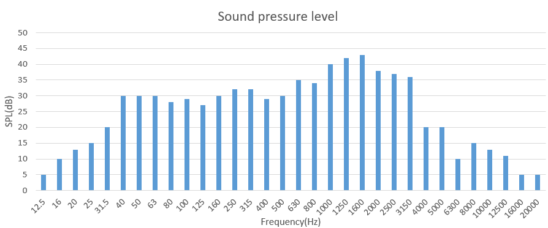

# Sound quality index

## 聲壓位準(SPL)

1. 麥克風所收到的**聲音訊號和人耳能夠接收到的最小值的相對值**

    $SPL$ = $20log_{10}(\frac{P_{rms}}{P_{ref}})$

    $P_{rms}$: P(t)的方均根植，也稱為有效聲壓(effective sound pressure)

    $P_{ref}$: 人耳能感知的最小壓力值(20$\mu Pa$)

    Standard sensitivity of microphone: 46.44mv/Pa
    
    Unit: dB or dBA

2. 不同音源的SPL疊加

    $SPL_{s}$ = $10log_{10}(\Sigma{10^{\frac{SPL_i}{10}}})$
    
3. 三分之一八音頻帶(1/3 Octave band)

    在0~20k Hz間，切分不同頻帶，每個頻帶的上限頻率/下限頻率為2的立方根，$\frac{f_u}{f_l}$=$2^{1/3}$
    
    中心頻帶為上限頻率和下限平率成績的平方根，$f_c = \sqrt{f_uf_l}$
    
    
    
4. dB to dBA

    將原本所有的$SPL_i$做總和前，先用以A-Weight權重增益其值，再做加總。
    
    $SPL_{s}$ = $10log_{10}(\Sigma_{i=1}^{n}{10^{\frac{SPL_i+weight}{10}}})$
    
    
    
    source: https://acousticalengineer.com/a-weighting-table/

## Prominence Ratio (dB)

## Modulation(%):

## Reference:

1. https://acousticalengineer.com/a-weighting-table/

2. http://aitanvh.blogspot.com/2017/05/blog-post.html

3. http://aitanvh.blogspot.com/2018/01/blog-post_22.html?m=0

4. https://www.linuxdataacquisition.com/docs/tn257.pdf

5. http://www.pal-acoustics.com/index.php?a=services&id=109&lang=cn

6. https://dsp.stackexchange.com/questions/1059/how-do-you-plot-an-spl-vs-frequency-curve-for-a-given-set-of-pressure-data